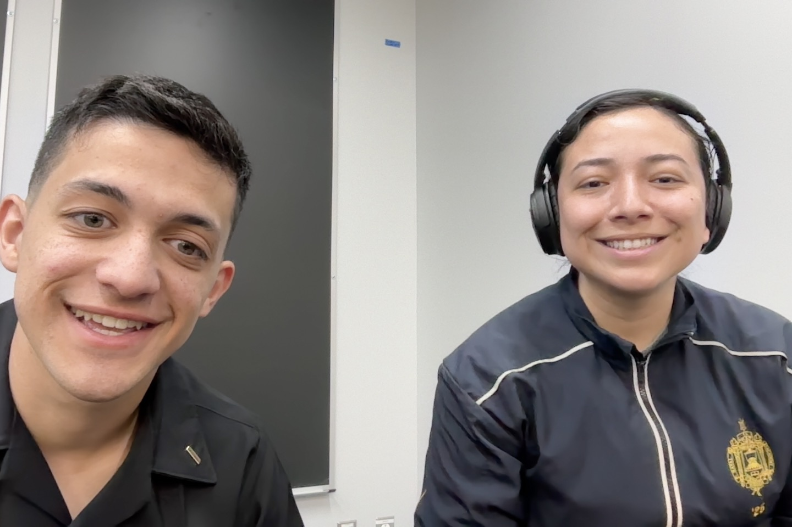

# Intro
Our names are Ivette Ayala and Juan Ortiz, and we are First Clas Midshipman (senior year students) at the United States Naval Academy. As we began the Spring Semester for the Academic Year 2025, we took the smartest decision on Earth and enrolled for PROG. & PLAN. FOR MOBILE ROBOTS (EW458.) This course explores modern robotic programming tools and their application in developing and implementing high level mobile robot applications. Topics include but are not limited to: mapping, autonomous navigation, algorithm design, logic and state machines. Various challenges are used to give students practical experience with using the techniques on robot hardware.

This website will run you through how we were able to accomplish our amazing Mapping Software that was able to map out Hopper Hall through the use of ROSLIBPY, Python, and HTML.

# Inspiration Section

We chose to use roslibpy because it allowed us to bridge the gap between powerful ROS tools and a lightweight, web-based interface for real-time mapping. Its flexibility enabled us to create a dynamic visualization of our environment—both inside our Hopper Hall classroom and in the surrounding spaces. By integrating LiDAR data and odometry through ROS topics, we were able to build an interactive occupancy grid map accessible from any browser. This solution not only made robotics more accessible but also showcased the power of remote collaboration and live spatial awareness.


# Dependencies
You will need the following softwares and libraries:
- Python
    - https://www.python.org/downloads/
- Roslibpy
    - https://www.python.org/downloads/

# Roslibpy Library Installation
Linux: `pip3 install roslibpy`
Windows: `pip installs roslibpy`

# Pseudocode for Map

This script allows manual control of a ROS-based robot using keyboard input, while also dynamically building an occupancy grid map using laser scan data.

---

## How It Works (High-Level Summary)

- **Connects to ROS** via `roslibpy` over WebSockets.
- **Subscribes** to `odom` and `scan` topics.
- **Publishes** velocity commands to `/cmd_vel`.
- **Listens to keyboard input** (WASD, spacebar, etc.).
- **Updates a 2D map** in real-time from laser scan data.
- **Publishes a map** to `/saltymap` for visualization.

---

## Pseudo Code Breakdown

```pseudo
1. Initialize ROS connection
    - Connect to IP and port
    - Subscribe to odometry and laser scan topics
    - Set up publishers for velocity and occupancy grid

2. Track robot position from odometry
    - Convert quaternion to yaw (heading angle)
    - Store x, y, theta (pose)

3. Listen for keyboard input:
    - W: move forward
    - A: rotate left
    - D: rotate right
    - Space: toggle armed/disarmed state
    - R: reset pose/map
    - G: toggle continuous map updates
    - T: trigger manual map update
    - Q: quit and shut down

4. Update map:
    - For each valid laser scan:
        - Convert polar scan data to Cartesian (x, y)
        - Convert to grid coordinates
        - Mark free space (-1) and obstacles (20)
        - Merge with existing occupancy grid
    - Publish map as a `nav_msgs/OccupancyGrid` message

5. Loop:
    - If armed and movement keys are pressed:
        - Publish velocity command
        - Optionally update the map every 0.2s
```

# How to run
``` bash
python3 FILENAME.py
```

# Example Maps
The following maps were generated through motion through Hopper Hall


The following GIF is the scan from the robot, as it entered the classroom again, and completed the "A" shape scan.


# Designers
